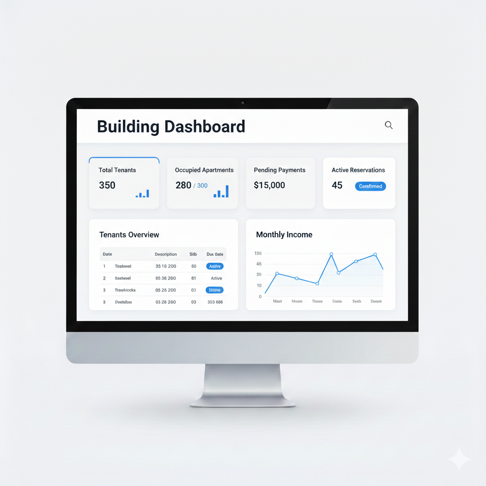
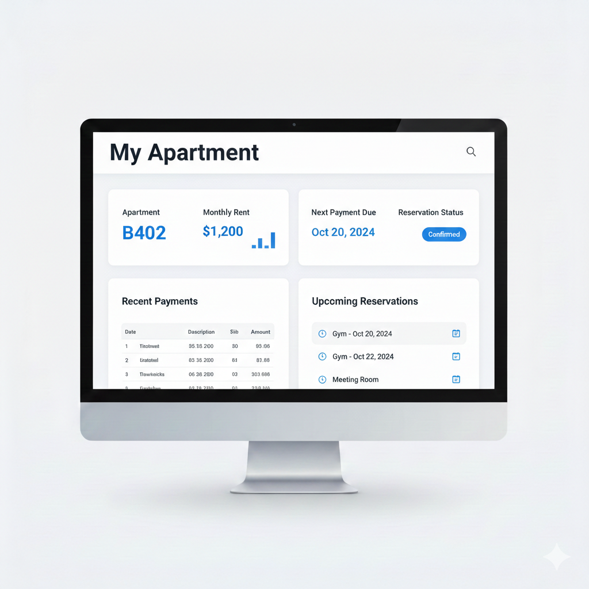
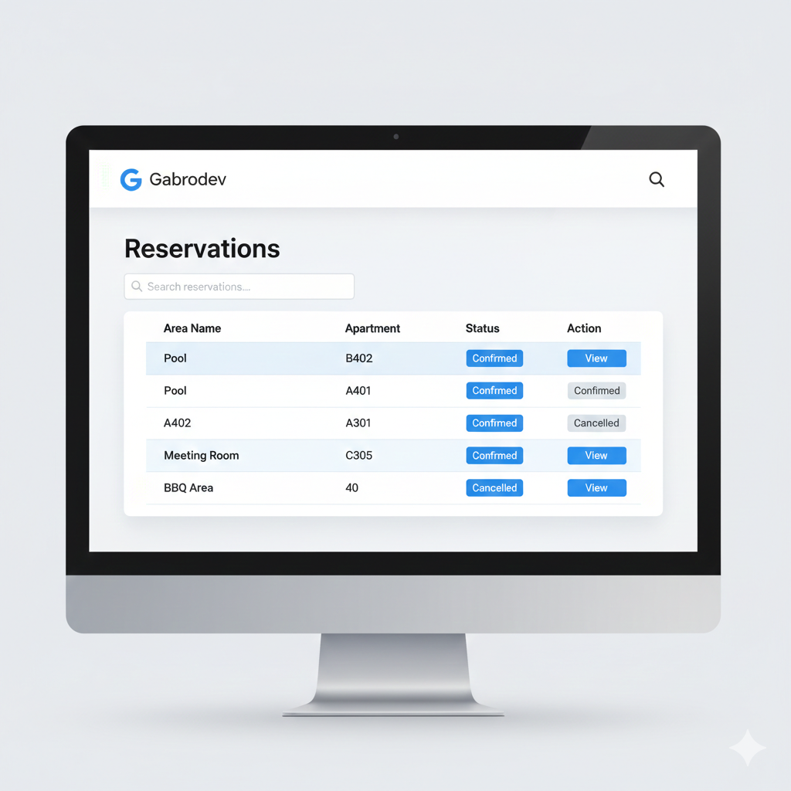
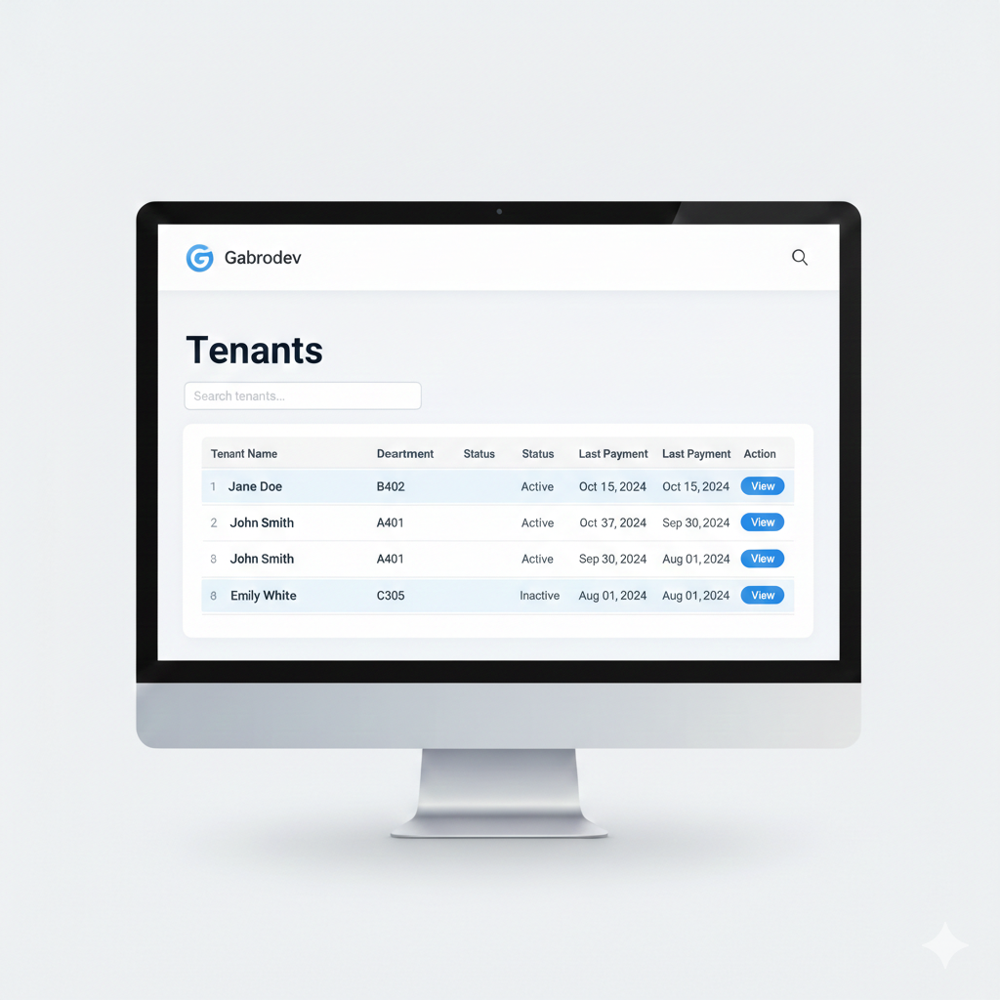

# React Feature Flag Demo

A production-minded React + TypeScript + Tailwind application integrated with a PHP API to demonstrate feature flags, role-based access control, and scalable frontend architecture.

## Project Description

This project exists to model a realistic frontend architecture for modern web apps that need controlled feature rollout and role-aware UI behavior without overengineering.

It solves three common product and engineering problems:

- Releasing UI features safely without redeploying frontend code.
- Serving different experiences to different user roles (admin vs tenant/customer).
- Keeping UI code maintainable as pages, states, and business logic grow.

### Architecture Overview

- Frontend: React + TypeScript + Tailwind (Vite)
- Backend: PHP mock API (`/backend`) with JSON responses
- Integration: Vite dev proxy maps `/api/*` to `http://127.0.0.1:8000/backend/*`

Frontend responsibilities:

- Rendering role-specific pages and navigation.
- Managing auth/feature state via React Context.
- Consuming backend endpoints through service-layer abstractions.

Backend responsibilities:

- Returning feature flag data, login response, and user/domain data.
- Simulating production API shapes without a database.

### Feature Flags + RBAC Strategy

- Feature flags are fetched from backend and stored globally in `FeatureFlagContext`.
- `useFeature(featureName)` centralizes feature evaluation logic.
- RBAC is enforced at route level (`RequireRole`) and reinforced in UI rendering.
- Final visibility = **role permission + feature flag state**.

This layered approach reduces accidental exposure of restricted UI and improves predictability in large systems.

## Table of Contents

1. [Demo](#demo)
2. [Features Implemented](#features-implemented)
3. [Tech Stack](#tech-stack)
4. [Installation](#installation)
5. [Usage](#usage)
6. [API Reference](#api-reference)
7. [Folder Structure](#folder-structure)
8. [Testing](#testing)
9. [Contribution Guidelines](#contribution-guidelines)
10. [Execution Path](#execution-path)
11. [Author](#author)

## Mock Screens

<p align="center">
  
  <br />
  <sub><strong>Login.png</strong></sub>
</p>

<p align="center">
  
  <br />
  <sub><strong>HomeAdmin.png</strong></sub>
</p>

<p align="center">
  
  <br />
  <sub><strong>HomeClient.png</strong></sub>
</p>

<p align="center">
  
  <br />
  <sub><strong>Reserve_List.png</strong></sub>
</p>

<p align="center">
  
  <br />
  <sub><strong>Tenant_list.png</strong></sub>
</p>

<p align="center">
  
  <br />
  <sub><strong>payments_list.png</strong></sub>
</p>

## Features Implemented

- Authentication flow with role-based routing:
  - Admin experience
  - Tenant/customer experience
- Global app navigation with role-aware menu options.
- Feature flag integration from backend endpoint.
- Tenant module:
  - Home
  - Lease detail
  - Payments history
  - Payment checkout (card/bank validation + success states)
  - Reservations and reservation details
- Admin module:
  - Dashboard
  - Tenants list
  - Tenant detail
- Shared pages:
  - Login
  - About
  - Profile
  - Reservation flows
- Reusable UI and layout primitives:
  - `Button`
  - `MainLayout`
- Error-safe API parsing for user-friendly failure messaging.
- Automated tests for `useFeature` behavior with mocked context.

## Tech Stack

- React 19
- TypeScript (strict mode)
- Tailwind CSS
- React Router
- Vite
- Vitest + Testing Library
- PHP (mock backend APIs)

## Installation

### 1) Clone and install frontend dependencies

```bash
git clone https://github.com/GabrielWitt/react-feature-flag-demo.git
cd react-feature-flag-demo
npm install
```

### 2) Start PHP backend

Requires PHP installed locally.

```bash
npm run dev:backend
```

This starts:

- `http://127.0.0.1:8000`

### 3) Start frontend

In a second terminal:

```bash
npm run dev
```

Frontend runs via Vite (default `http://127.0.0.1:5173` unless changed).

### 4) Run both together

- Terminal A: `npm run dev:backend`
- Terminal B: `npm run dev`

## Usage

### Demo login accounts

- Admin:
  - Email: `admin@gabrodev.com`
  - Password: `admin`
- Tenant:
  - Email: `tenant@gabrodev.com`
  - Password: `client`

### Role behavior

- Admin can access admin pages (`/admin`, `/admin/tenants`, etc.).
- Tenant can access tenant pages (`/tenant`, `/tenant/payments`, etc.).

### Feature flag behavior

- Frontend fetches flags from backend on app start.
- UI sections/components are conditionally rendered using `useFeature`.
- This enables runtime feature control without frontend redeploy.

## API Reference

All endpoints return JSON with CORS/content headers.

### `GET /backend/flags.php`

Returns feature flags.

### `POST /backend/login.php`

Authenticates demo user and returns token + user payload.

Request body:

```json
{
  "email": "admin@gabrodev.com",
  "password": "admin"
}
```

### `GET /backend/users.php`

Returns users and tenant-related dashboard/payment data.

### Frontend API paths (via proxy)

Frontend uses `/api/*` paths, mapped by Vite proxy to `/backend/*`.

## Folder Structure

```text
src/
  components/
    layout/
    ui/
  context/
  hooks/
    __tests__/
  pages/
    admin/
    shared/
    tenant/
  services/
  test/
  types/
  utils/
backend/
```

Why this structure:

- `components/`: reusable visual building blocks.
- `context/`: shared app state (auth, feature flags).
- `hooks/`: behavior abstraction (`useFeature`, `useAuth`).
- `pages/`: route-level features grouped by domain/role.
- `services/`: API/data access separation from UI.
- `types/`: shared contracts for strict typing and safer refactors.
- `utils/`: generic helpers (e.g., response parsing).
- `backend/`: local PHP API simulation for realistic integration workflows.

## Testing

Quality checks:

```bash
npm run typecheck
npm run lint
npm run format:check
```

Run tests:

```bash
npm run test:run
```

Watch mode:

```bash
npm run test
```

Current automated coverage includes:

- `useFeature` hook behavior:
  - enabled flag => `true`
  - disabled flag => `false`
  - missing flag => `false`

Why this matters:

- Feature gating is a high-impact branch point in UI behavior.
- Hook-level tests protect against regressions when flags or context evolve.

## Contribution Guidelines

1. Fork the repo.
2. Create a branch: `feature/<short-description>`.
3. Keep changes scoped and typed.
4. Add/update tests for behavior changes.
5. Run:
   - `npm run build`
   - `npm run test:run`
6. Open a PR with:
   - problem statement
   - approach
   - screenshots (if UI changes)
   - risk notes

Engineering standards:

- Prefer reusable components over duplicated markup/styles.
- Keep business logic in hooks/services, not deeply inside JSX.
- Preserve strict TypeScript safety.

## Execution Path

This is the implementation route we will follow to move this project from "good demo" to "senior-level frontend reference."

### Current Status

- `Phase 0` completed successfully.
- `Phase 1` completed successfully.
- `Phase 2` completed successfully.
- `Phase 3` completed successfully.
- `Phase 4` in progress.
- Implemented so far:
  - quality scripts: `typecheck`, `lint`, `lint:fix`, `format`, `format:check`.
  - ESLint + Prettier + EditorConfig baseline.
  - CI workflow with gates for format check, lint, typecheck, tests, and build.
  - root app hardening to ensure providers are always mounted with routes.
  - auth session hardening with persisted session restore, expiration handling, and centralized auth state transitions.
  - shared cached data layer introduced with React Query.
  - feature flags migrated to shared query-based fetching (dedupe + cache).
  - tenant/admin pages migrated away from duplicated `TENANTS` source to API-backed users data.
  - duplicated page-level users fetch logic consolidated into shared hooks.
  - React Query provider added at app root for cross-page cache reuse.
  - tenant scoping migrated from hardcoded apartment values to authenticated user claims.
  - explicit forbidden and not-found screens added for unauthorized/missing resources.
  - authorization rules centralized in reusable utilities.
  - RBAC and tenant-scope tests added for authorization behavior.
  - semantic form labels and accessible feedback states added in core forms.
  - interactive cards replaced with keyboard-friendly actions in tenant home flows.
- Validation executed successfully:
  - `npm run format:check`
  - `npm run lint`
  - `npm run typecheck`
  - `npm run test:run`
  - `npm run build`

### Phase 0 - Baseline and quality gates

- Add `lint`, `lint:fix`, and `typecheck` scripts.
- Configure ESLint + Prettier.
- Add CI checks for build, typecheck, lint, and tests.
- Definition of Done:
  - every PR fails if quality gates fail.
  - local + CI commands are documented and reproducible.

### Phase 1 - Auth and session hardening

- Persist auth session (token + user) and restore it on app boot.
- Add logout cleanup and invalid/expired session handling.
- Centralize auth state transitions (idle/loading/success/error).
- Definition of Done:
  - page refresh keeps user logged in when session is valid.
  - unauthorized/expired sessions redirect predictably.

### Phase 2 - Data layer architecture

- Replace scattered page-level fetches with a shared data layer (React Query/SWR).
- Add request deduplication, caching, and consistent loading/error states.
- Remove duplicate data sources (`TENANTS` mock vs API source of truth).
- Definition of Done:
  - no duplicated fetch logic across pages.
  - each domain screen consumes typed shared queries/hooks.

### Phase 3 - RBAC and tenant-scoped authorization

- Remove hardcoded apartment checks (`B402`) and use authenticated user claims.
- Enforce role + tenant scope at route level and view level.
- Add explicit forbidden/not-found states.
- Definition of Done:
  - tenant users can only read/write their own records.
  - authorization rules are centralized and test-covered.

### Phase 4 - UX and accessibility uplift

- Add semantic form labels, keyboard support, and focus management.
- Replace clickable cards with accessible interactive patterns.
- Standardize empty, loading, and error states across modules.
- Definition of Done:
  - main flows are keyboard navigable.
  - core screens pass basic accessibility checks.

### Phase 5 - Test strategy and confidence

- Add unit tests for auth context, route guards, and API adapters.
- Add integration tests for critical role-based flows.
- Add E2E tests for login, navigation, reservations, and payments.
- Definition of Done:
  - critical user journeys are covered end-to-end.
  - regressions in RBAC/feature flags are caught before merge.

### Suggested delivery sequence

1. Phase 0 and Phase 1
2. Phase 2
3. Phase 3
4. Phase 4
5. Phase 5

### Why this order

- It reduces risk first (auth + quality gates), then improves architecture, then strengthens authorization, and finally scales confidence with testing.

## Author

Gabriel Witt  
GitHub: https://github.com/GabrielWitt
